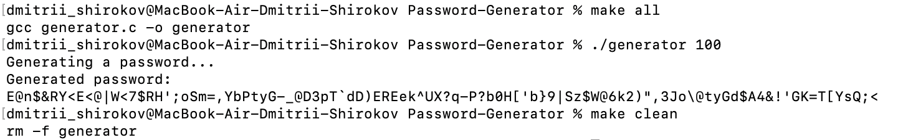

# Password Generator

## :paperclip: Description

This is a C project that generates random passwords of a given length. Password
are strong and safe to use.

## :bullettrain_front: Run the program on Linux/MacOS

```bash
make all # Builds the program
```
```bash
./generator 10 # Instead of 10, you can enter any password length
```
```bash
make clean # Clears the assembly
```

## :eyes: Images

An example of how the program works!



## :octocat: Author

**Dima M. Shirokov**
- [GitHub](https://github.com/1123581321345589144233377610)
