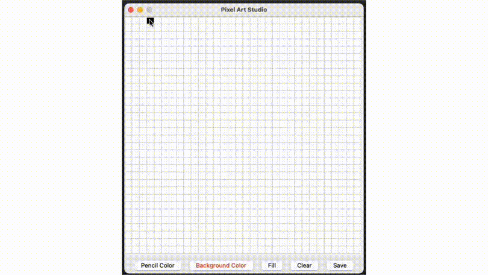

# Pixel Art Studio

<div align='center'>
    
</div>

## 📟 Description

This is a Python + tkinter project that allows you to create 32x32 block pixel art and save them to an PNG file.

Opportunities:

- **LBM - pencil**
- **RBM - eraser**
- **Held LBM - multiple drawing**
- **Held RBM - multiple erasure**
- **Pencil Color Button - choose a pencil color**
- **Background Color Button - choose the background fill color**
- **Fill Button - fill in the background**
- **Clear Button - clear the canvas**
- **Save Button - save the image as a PNG file**

## 📱 Requirements

- pillow
- tkinter
  
## 🏎️ Run the program

While in the folder /Small-Projects/Pixel-Art-Studio, run the command below.

```console
pip install -r requirements.txt
```

Meanwhile, in the folder /Small-Projects/Pixel-Art-Studio/src, run the command below.

```console
python3 main.py
```

## 🎨 Portfolio

Examples of work done in this application.


## :octocat: Author

**Dima M. Shirokov**
- [GitHub](https://github.com/dimamshirokov)